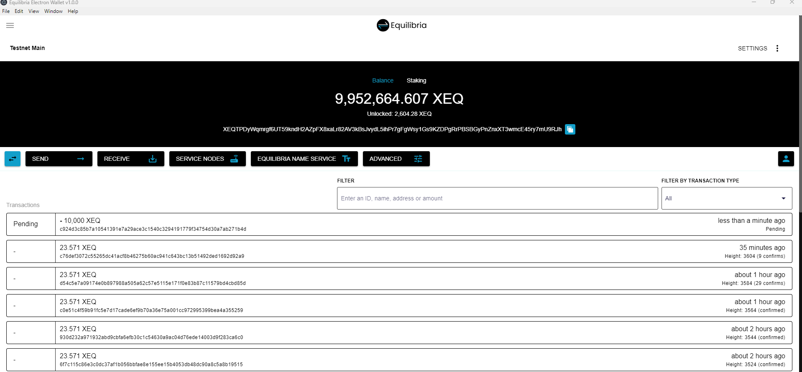

# Equilibria Electron GUI Wallet

### Introduction

Equilibria is a private cryptocurrency based on Monero. Equilibria aims to provide a private data transmission layer using a second layer of Service Nodes. More information on the project can be found on the [website](https://equilibria.network).



---

## 🚀 Quick Start Guide (For End Users)

This guide will help you get the Equilibria Electron GUI Wallet running on your Windows or Linux PC. You don't need to build anything - just download, set up Docker, and run!

### Prerequisites

Before you begin, make sure you have:

1. **Docker Desktop** installed and running

   - **Windows**: Download from [docker.com/products/docker-desktop](https://www.docker.com/products/docker-desktop/)
   - **Linux**: Install Docker Engine - see [docker.com/docs/engine/install](https://docs.docker.com/engine/install/)
   - Make sure Docker is running before proceeding

2. **Internet connection**

That's it! No need to build Equilibria Core or install Node.js.

---

## Step-by-Step Setup

### Step 1: Download the GUI Wallet

1. Go to the [Releases page](https://github.com/EquilibriaHorizon/equilibria-electron-gui-wallet/releases)
2. Download the latest release for your operating system:
   - **Windows**: Download `equilibria-electron-wallet-{version}-win.exe` (installer) or `equilibria-electron-wallet-{version}-portable.exe` (portable)
   - **Linux**: Download `equilibria-electron-wallet-{version}-linux.AppImage` (portable) or `equilibria-electron-wallet-{version}-linux.deb` (installer)

### Step 2: Extract/Run the GUI Wallet

**Windows:**

- **Installer**: Double-click the `.exe` file and follow the installation wizard
- **Portable**: Extract the `.exe` file to a folder and double-click it to run

**Linux:**

- **AppImage**: Make it executable (`chmod +x equilibria-electron-wallet-*.AppImage`) and double-click to run
- **Debian Package**: Install with `sudo dpkg -i equilibria-electron-wallet-*.deb`

**Note**: Don't open the wallet yet! First, we need to set up the Docker containers.

### Step 3: Start the Service Node (Daemon) in Docker

**Important:** Replace `YOUR_PUBLIC_IP_ADDRESS` with your actual public IP address. You can find your public IP by visiting https://api.ipify.org or running:

- **Windows (PowerShell):** `(Invoke-WebRequest -Uri "https://api.ipify.org" -UseBasicParsing).Content`
- **Linux:** `curl https://api.ipify.org`

Open a terminal/command prompt and run:

**Linux:**

```bash
docker run -dit \
  --name sn01 \
  -p 18090:18090 \
  -p 18091:18091 \
  -p 38160:38160 \
  -v "${PWD}/data/sn01:/data" \
  ghcr.io/equilibriahorizon/equilibria-node:latest \
  --testnet \
  --dev-allow-local-ips \
  --service-node \
  --fixed-difficulty=750 \
  --data-dir=/data \
  --p2p-bind-ip=0.0.0.0 \
  --p2p-bind-port=18090 \
  --rpc-bind-port=18091 \
  --service-node-public-ip=YOUR_PUBLIC_IP_ADDRESS \
  --l2-provider=http://84.247.143.210:8545 \
  --quorumnet-port=38160 \
  --log-level=2
```

**Windows PowerShell:**

```powershell
docker run -dit `
  --name sn01 `
  -p 18090:18090 `
  -p 18091:18091 `
  -p 38160:38160 `
  -v "${PWD}\data\sn01:/data" `
  ghcr.io/equilibriahorizon/equilibria-node:latest `
  --testnet `
  --dev-allow-local-ips `
  --service-node `
  --fixed-difficulty=750 `
  --data-dir=/data `
  --p2p-bind-ip=0.0.0.0 `
  --p2p-bind-port=18090 `
  --rpc-bind-port=18091 `
  --service-node-public-ip=YOUR_PUBLIC_IP_ADDRESS `
  --l2-provider=http://84.247.143.210:8545 `
  --quorumnet-port=38160 `
  --log-level=2
```

Wait a few seconds for the container to start. You can verify it's running with:

```bash
docker ps
```

You should see a container named `sn01` running.

### Step 4: Start the Wallet RPC in Docker

In the same terminal, run:

**Linux:**

```bash
docker run -d \
  --name wallet-rpc \
  -p 18084:18084 \
  --restart unless-stopped \
  --entrypoint /usr/local/bin/xeq-wallet-rpc \
  -v "${PWD}/wallets:/data" \
  ghcr.io/equilibriahorizon/equilibria-node:latest \
  --testnet \
  --rpc-bind-ip=0.0.0.0 \
  --rpc-bind-port=18084 \
  --daemon-address=127.0.0.1:18091 \
  --disable-rpc-login \
  --wallet-dir=/data \
  --log-level=3
```

**Windows PowerShell:**

```powershell
docker run -d `
  --name wallet-rpc `
  -p 18084:18084 `
  --restart unless-stopped `
  --entrypoint /usr/local/bin/xeq-wallet-rpc `
  -v "${PWD}\wallets:/data" `
  ghcr.io/equilibriahorizon/equilibria-node:latest `
  --testnet `
  --rpc-bind-ip=0.0.0.0 `
  --rpc-bind-port=18084 `
  --daemon-address=127.0.0.1:18091 `
  --disable-rpc-login `
  --wallet-dir=/data `
  --log-level=3
```

**Note:** The wallet RPC uses port 18084. If the GUI doesn't connect automatically, you may need to configure the wallet RPC port in the GUI settings.

Verify both containers are running:

```bash
docker ps
```

You should see both `sn01` and `wallet-rpc` running.

### Step 5: Open the GUI Wallet

Now you can open the Equilibria Electron GUI Wallet:

- **Windows**: Double-click the desktop shortcut (if installed) or the executable file
- **Linux**: Double-click the AppImage or launch from your applications menu

The wallet should connect to your Docker containers automatically. If you see "Connected" in the status bar, you're all set!

---

## Using the Wallet

### Creating a New Wallet

1. Click **"Create New Wallet"**
2. Enter a wallet name
3. Choose a strong password (or leave blank for no password)
4. Save your seed phrase in a safe place - you'll need it to restore your wallet!
5. Click **"Create Wallet"**

### Opening an Existing Wallet

1. Select your wallet from the list
2. Enter your password if the wallet is password-protected
3. Click **"Open"**

### Sending XEQ

1. Click the **"Send"** tab
2. Enter the recipient's address
3. Enter the amount
4. Choose transaction speed (Blink for instant, Slow for regular)
5. Click **"Send"**

### Receiving XEQ

1. Click the **"Receive"** tab
2. Copy your wallet address or scan the QR code
3. Share this address with the sender

---

## Troubleshooting

### GUI Won't Connect

**Check Docker containers are running:**

```bash
docker ps
```

If containers aren't running, start them:

```bash
docker start sn01
docker start wallet-rpc
```

**Check container logs:**

```bash
docker logs equilibria-daemon
docker logs equilibria-wallet-rpc
```

### Port Already in Use

If you get an error about ports being in use, you may have another instance running. Stop existing containers:

```bash
docker stop sn01 wallet-rpc
docker rm sn01 wallet-rpc
```

Then restart them using the commands in Steps 3 and 4.

### Wallet RPC Connection Issues

Make sure the wallet RPC container can reach the daemon. On Windows, you may need to use `host.docker.internal` instead of `127.0.0.1`:

**Windows PowerShell:**

```powershell
docker run -d `
  --name wallet-rpc `
  -p 18084:18084 `
  --restart unless-stopped `
  --entrypoint /usr/local/bin/xeq-wallet-rpc `
  -v "${PWD}\wallets:/data" `
  ghcr.io/equilibriahorizon/equilibria-node:latest `
  --testnet `
  --rpc-bind-ip=0.0.0.0 `
  --rpc-bind-port=18084 `
  --daemon-address=host.docker.internal:18091 `
  --disable-rpc-login `
  --wallet-dir=/data `
  --log-level=3
```

### Resetting Everything

To start fresh (this will delete all wallet data):

**Warning:** This will delete your Service Node data and wallets!

```bash
docker stop sn01 wallet-rpc
docker rm sn01 wallet-rpc
rm -rf data/sn01 wallets  # Linux
# or on Windows PowerShell:
# Remove-Item -Recurse -Force data\sn01, wallets
```

Then follow Steps 3-5 again.

---

## Stopping the Containers

When you're done using the wallet, you can stop the Docker containers:

```bash
docker stop sn01 wallet-rpc
```

To start them again later:

```bash
docker start sn01
docker start wallet-rpc
```

---

## Testnet Configuration

The GUI wallet is configured to work with the Equilibria testnet by default. The default testnet ports are:

- **P2P Port:** 18090
- **Daemon RPC Port:** 18091
- **Wallet RPC Port:** 18084

**Note:** If your wallet RPC is running on a different port, you may need to configure it in the GUI settings.

These ports are configured in the Docker commands above. If you need to change them, update the port mappings in the `docker run` commands.

---

## Service Node Features

The GUI wallet includes full service node functionality:

- Register new service nodes
- Stake to existing service nodes
- View service node details and status
- View network statistics
- Manage your staked service nodes
- Unlock staked funds

---

## For Developers

### Building from Source

If you want to build the wallet from source or contribute to development:

#### Prerequisites

- Node.js (version 14.x or 16.x recommended)
- npm
- Git

#### Installation

```bash
git clone https://github.com/EquilibriaHorizon/equilibria-electron-gui-wallet.git
cd equilibria-electron-gui-wallet
npm install
```

#### Development

Run the wallet in development mode:

```bash
npm run dev
```

#### Building Executables

Build for your current platform:

```bash
npm run build
```

Build for specific platforms:

```bash
# Windows
npm run build:win

# Linux
npm run build:linux

# macOS
npm run build:mac

# Both Windows and Linux
npm run build:all
```

Built executables will be in the `dist/electron/` directory.

**Note:** Building will only create binaries for the system you run the command on. Running `npm run build` on Linux will only make Linux binaries, not Windows or macOS binaries.

### Contributing

Please submit any changes as pull requests to the development branch. All changes are assessed in the development branch before being merged to master. Release tags are considered stable builds for the GUI.

### Adding Language Support

Adding a new language is fairly simple:

1. Duplicate the language file `src/i18n/en-us.js` and rename it to the relevant language code.
2. Translate all the strings in that duplicated file. Take note that capitalization matters.
   - The translated string must go in-between the quotes (`""`)
     - E.G `all: "ALL"` -> `all: "ВСЕ"`
   - If possible try and stick to the general string formatting already present.
     - E.G if there is a new line then try and keep that in your translation.
     - The same goes for the pipe character `|`. **DO NOT REMOVE IT**.
   - Please don't translate strings inside `{}` brackets. They are meant as placeholders for other values.
     - Some examples include `{type}` and `{count}`.
     - E.G if you have a string `A {index}` then you may translate it as `B {index}` or `{index} B` depending on how the string makes sense in your language. You are allowed to reposition the placeholders for the string to make sense **BUT DO NOT DELETE OR REPLACE THE PLACEHOLDERS WITH OTHER VALUES**
3. Add the language to the `languages` array in `src/i18n/index.js`. The `flag` property is the [ISO 3166-1-alpha-2 code](https://www.iso.org/obp/ui/#search/code/) of a country.
   - **NOTE: DO NOT ADD THE LANGUAGE TO `export default`**. Dynamic language loading is handled by the application.
4. Add your language locale to Vue Timeago. Add it in `src/plugins/timeago.js` under `locales`.
   - Ref: https://github.com/egoist/vue-timeago#update-locale-globally
5. Submit a PR with your changes.

---

## License

This project is open source and completely free to use without restrictions. Anyone may create an alternative implementation of the Equilibria Electron GUI that uses the protocol and network in a compatible manner.

---

## Support

For issues, questions, or contributions, please visit:

- **GitHub**: [github.com/EquilibriaHorizon/equilibria-electron-gui-wallet](https://github.com/EquilibriaHorizon/equilibria-electron-gui-wallet)
- **Documentation**: [equilibria-network.gitbook.io/docs](https://equilibria-network.gitbook.io/docs)
- **Telegram**: [t.me/XEQCommunity](https://t.me/XEQCommunity)
